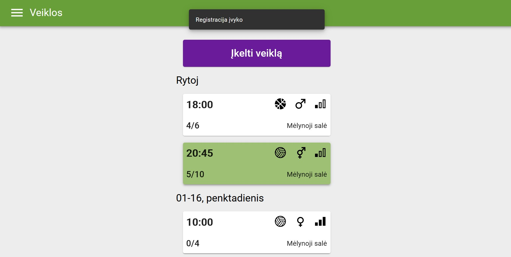
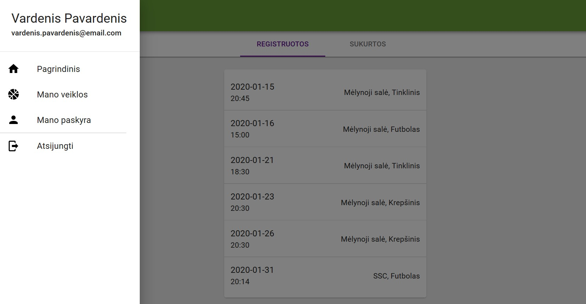
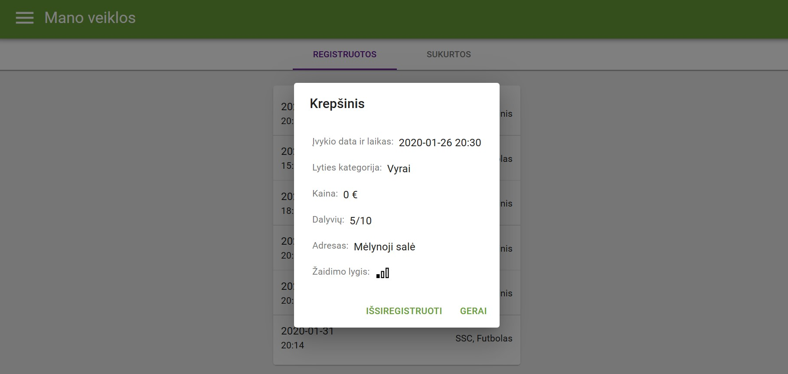
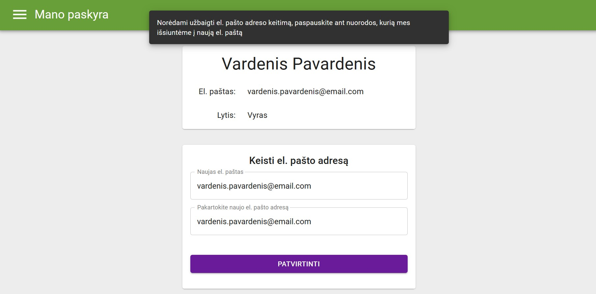
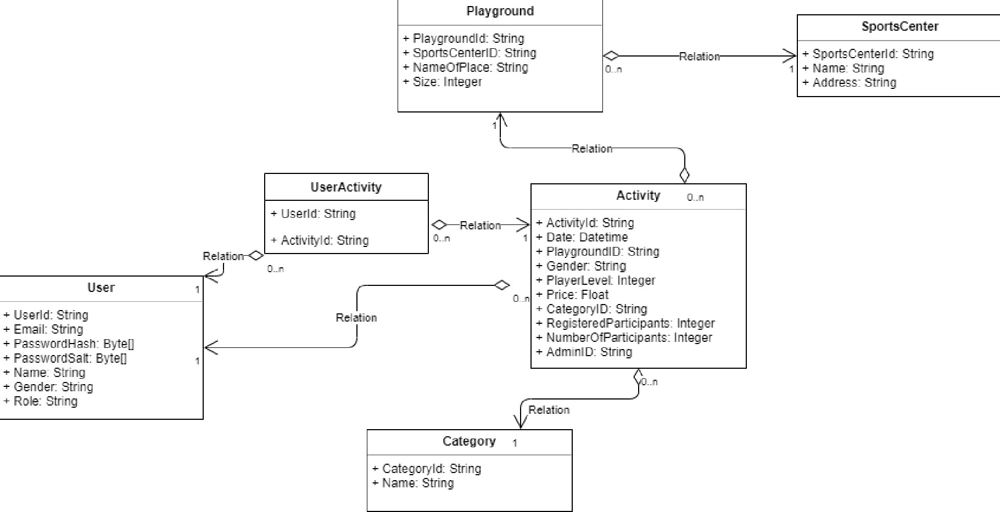
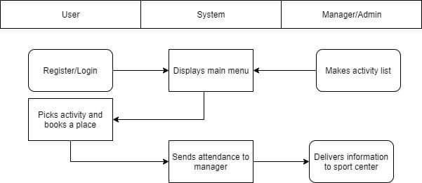
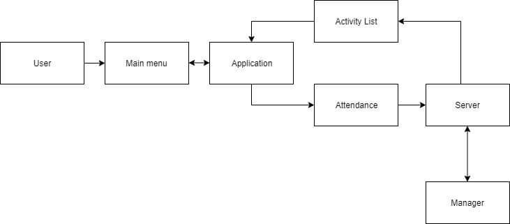

# Sport Matchmaker
## Introduction
Sport Matchmaker is a web application that helps you to find teammates for your next game match, whether it was football, basketball or even quidditch!

https://sportmatchmaker.azurewebsites.net/

## Team

| Paulius Zaranka | Mantas Ptakauskas | Augustina Šareikaitė | Tomas Noreika | Karolis Murza |
| ------------------ | ------------- | --------------------- | ------------- | ------------- |
| Front-End          | Back-End      | Front-End             | Documentation | Testing       |
| Documentation      | Documentation | Documentation         |               |              |

## Tools
FRONT-END:
- **Technologies:** HTML, CSS, Typescript
- **Libraries:** React, Redux
- **NPM packages:** Material-ui, React Router, react-cookie
- **Text editor:** Visual Studio Code with Prettier and ESLint tools

 [Full front-end documentation in Lithuanian](https://docs.google.com/document/d/17UwbDZ4sbWs5CKXFLEzB4htjaoNxdoPIFCllXLUmhqE/edit?usp=sharing)
  
  
 BACK-END:
 - **Technologies:** ASP.NET Core 3, PostgreSQL, Entity Framework Core, Npgsql, SendGrid
 - **Deployment:** Azure App Service free tier Linux server, ElephantSQL
 
 [Full back-end documentation in Lithuanian](https://docs.google.com/document/d/1vQDvDbZ8ORLAiSoH73rEB2Gjn54BzVsju4YFRih8GZw/edit?usp=sharing)

## Example photos

## Entity Diagram

## Activity Diagram

## Data Flow Scheme

## Documentation:
- [Statement of Work (SOW)](https://docs.google.com/document/d/1f2q7HX6lgKn_48jiSNoGwKHPHnVFVlc3K3mD9gtAv9o/edit?usp=sharing)
- [Project Charter](https://docs.google.com/document/d/1KuuiI13Gkdu2LNy9MntIItiaPqzltD8QFeDosQzyM-c/edit?usp=sharing)
- [Project Timeline](https://drive.google.com/file/d/0BwgZkBNBju45UUNlRTZ0bUFoa0xZZDJSZmQtcUdmajlBdkx3/view?usp=sharing)
